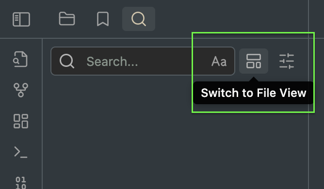

# Obsidian-Float-Search

[github連結](https://github.com/Quorafind/Obsidian-Float-Search)

Obsidian-Float-Search 是一個 Obsidian 增強插件,可以讓你在 Obsidian 中使用浮動式搜尋視窗。原生的插件只能固定在左方視窗列出搜尋結果,而這個插件可以將搜尋視窗固定在畫面正中間，讓你可以在不移動視線快速搜尋文件，大幅提升了搜尋體驗。

# 如何安裝
1. 打開 Obsidian，按下 Ctrl+Shift+P 開啟插件安裝視窗
2. 搜尋 "Obsidian Float Search"，然後按下 enter 安裝
3. 安裝完成後啟動插件，就可以使用新搜尋視窗
4. 可以在搜尋欄位右邊的這一個按鈕，選擇要使用的搜尋視窗模式

